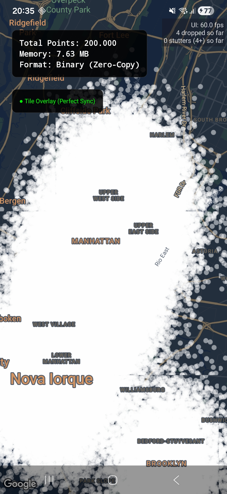

# Expo Spatial Layer Showcase 🌍⚡

A professional-grade demonstration of the **Expo Spatial Layer Engine**, a high-performance native library for rendering and interacting with massive geospatial datasets in React Native.

[](https://expo.dev)
[](https://www.typescriptlang.org/)
[](https://isocpp.org/)

## 🚀 The Mission

Visualizing millions of points on a mobile map without lag or synchronization issues is a major challenge. This project showcases a solution that combines a **C++ QuadTree Engine** with **Google Maps Native Tiles** to achieve desktop-class performance on mobile devices.

## ✨ Key Features

- **1,000,000+ Points**: Smoothly handle massive datasets with sub-millisecond query times.
- **QuadTree Spatial Indexing**: $O(\log n)$ performance for rendering and picking.
- **Zero-Latency Interaction**: Instant point selection through JSI-bridged C++ logic.
- **Agnostic Styling**: Configure point colors and categories dynamically from JavaScript.
- **Binary Zero-Copy**: Direct `Float32Array` transfer to native memory for instant loading.



## 🏗️ Repository Structure

- [**`modules/expo-spatial-layer/`**](./modules/expo-spatial-layer/): The core high-performance engine.
- [**`app/spatial-test.tsx`**](./app/spatial-test.tsx): Industrial-grade demo showing picking, memory monitoring, and dynamic styles.
- **`convert_csv.py`**: Utility to transform raw CSV/Parquet data into efficient binary format.

---

## 📦 Getting Started

### 1. Prerequisites
- Node.js & npm/yarn
- Android Studio/SDK (for Android builds)
- Python 3 (for data conversion)

### 2. Prepare Data
The app uses a binary format for extreme speed. Convert the sample taxi data:
```bash
python3 convert_csv.py
```
*This generates `taxi-data.bin` in the `assets/` folder.*

### 3. Run the Showcase (coming soon to NPM)
```bash
npm install
npx expo run:android
```

---

## 📖 In-Depth Documentation

For advanced technical details, check the internal module docs:
- [**Technical Architecture**](./modules/expo-spatial-layer/ARCHITECTURE.md) - How JSI and QuadTree work.
- [**API Reference**](./modules/expo-spatial-layer/README.md) - Props and methods for the engine.

## 🗺️ Roadmap
Check our [**ROADMAP.md**](./ROADMAP.md) for future plans including iOS support, clustering, and heatmaps.

---

Built with ❤️ by the Geospatial Community.
