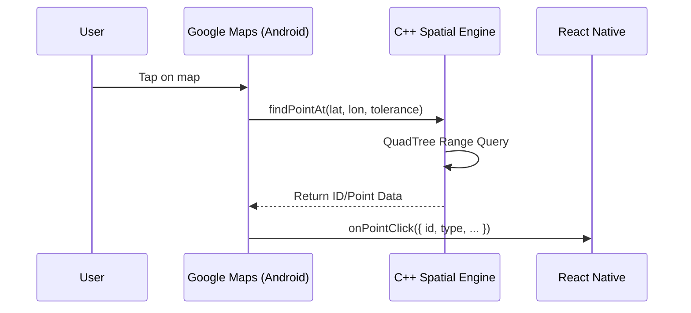

# Expo Spatial Layer Engine 🌏⚡

A high-performance native engine for rendering and interacting with large spatial datasets in React Native. Built with C++, JSI, and Google Maps Native Tiles.

## 🚀 Highlights
- **Elite Performance**: $O(\log n)$ indexing via C++ QuadTree.
- **Perfect Synchronization**: Rendered via `TileOverlay`, eliminating camera lag.
- **Agnostic by Design**: Dynamic styling and support for any data type via binary buffer.
- **Zero-Latency Picking**: Instant interactivity through the C++ engine via JSI.


---

## 📦 Installation (coming soon)

```bash
npx expo install expo-spatial-layer
```

### ⚙️ Android Setup

This module requires a valid Google Maps API Key. Add it to your `app.json` (or `app.config.js`):

```json
{
  "expo": {
    "android": {
      "config": {
        "googleMaps": {
          "apiKey": "YOUR_GOOGLE_MAPS_API_KEY_HERE"
        }
      }
    }
  }
}
```

> [!IMPORTANT]
> Since this module uses native code, you must create a new development build after installing: `npx expo run:android`.

---

## 📖 API Reference

### `<SpatialMapView />` Component

| Prop | Type | Description |
| :--- | :--- | :--- |
| `pointStyles` | `Record<number, number>` | Mapping from `type` to `hex color` (ARGB). E.g.: `{ 1: 0xFF00FFFF }` |
| `onPointClick` | `(event) => void` | Triggered when clicking a point. Returns `{ id, type, latitude, longitude }` |
| `center` | `LatLng` | Centers the map at specific coordinates. |
| `zoom` | `number` | Sets the initial/current zoom level. |
| `nightMode` | `boolean` | Toggles between light and dark themes (Google Maps JSON). |
| `useAutomaticCamera` | `boolean` | Automatically adjusts zoom to fit all points after loading. |

### C++ Engine (`SpatialLayer` JSI)
Accessible via `getSpatialLayer()`.

| Method | Description |
| :--- | :--- |
| `loadData(Float32Array)` | Loads points in a flat `[lat, lon, id, type]` format. Total size: `points * 4 * 4 bytes`. |
| `findPointAt(lat, lon, tol)`| Finds the closest point to coordinates with a specific tolerance. |
| `getDataBounds()` | Returns geographical bounds (`minLat`, `maxLon`, etc.) of loaded data. |
| `getMemoryUsage()` | Returns native memory consumption (bytes) of the C++ engine. |

---

## 🏗️ Architecture

The engine operates across 3 main layers:

1.  **UI Thread (JS)**: Manages state, colors, and receives interaction events.
2.  **Native Thread (Kotlin/Swift)**: Manages Google Maps lifecycle and Bitmap rendering for Tiles.
3.  **Engine Thread (C++)**: Where the "magic" happens. Stores data in a **QuadTree** and performs ultra-fast Web Mercator projections.

### Picking Sequence Diagram (Interactivity)


---

## 🗺️ Future Plans (Roadmap)
The following features are prioritized for production readiness:

1.  **Full iOS Parity**: Implement `MKTileOverlay` on iOS to consume the same C++ QuadTree engine.
2.  **Point Clustering**: Implement an $O(n)$ super-clustering algorithm in C++ to handle dense data at low zoom levels.
3.  **Dynamic Radius**: Expose point radius configuration to JavaScript for type-specific sizing.
4.  **Heatmap Mode**: GPU-accelerated density visualization using weighted points.
5.  **Web Support**: WebAssembly (WASM) fallback for MapLibre/Leaflet support.

---

## 🛠️ Performance Tips

1.  **Binary Buffer**: Always prefer sending data via `Float32Array` instead of JSON objects. This avoids serialization costs and allows C++ to access data directly.
2.  **Color Format**: Use integer ARGB format (e.g., `0xFF00FFFF`).
3.  **Memory**: 200k points occupy approximately 8MB in native memory.

---

## 📄 License
MIT
